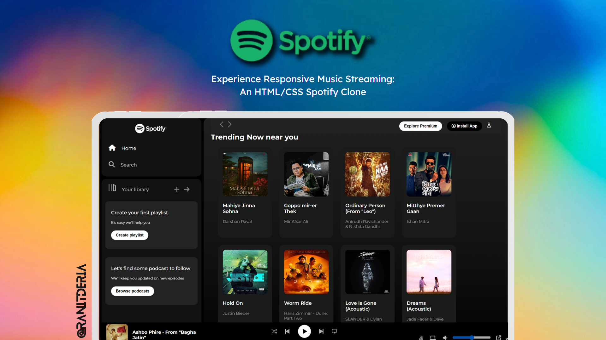

<div align="center">
  
  
  
  
[](https://twitter.com/intent/follow?screen_name=DeriaRAnit)

  <br />
  <br />
  
  

  <h2 align="center">Spotify - Clone Website</h2>

  Spotify - clone is music player website, <br />Responsive for all devices, built using <br />HTML and CSS.

  <a href="https://ranitderia.github.io/spotify-clone/"><strong>➥ Live Demo</strong></a>

</div>

<br />

### Demo Screeshots



### Prerequisites

Before you begin, ensure you have met the following requirements:

* [Git](https://git-scm.com/downloads "Download Git") must be installed on your operating system.

### Run Locally

To run **Spotify - Clone** locally, run this command on your git bash:

Linux and macOS:

```bash
sudo git clone https://github.com/RanitDERIA/spotify-clone.git
```

Windows:

```bash
git clone https://github.com/RanitDERIA/spotify-clone.git
```
### Installation

Download my-project from Github

[](https://github.com/RanitDERIA/spotify-clone)

### Contact

If you want to contact with me you can reach me at [LinkedIn](https://www.linkedin.com/in/ranit-deria-916864257/).

### Contributing

Contributions are always welcome!

If you'd like to contribute to this project, please follow these guidelines:

- Fork the repository
- Create a new branch for your feature or bug fix
- Make your changes and commit them with descriptive messages
- Push your changes to your fork
- Submit a pull request

Thank you for contributing to this project!

### License

This project is **free to use** and does not contains any license.
